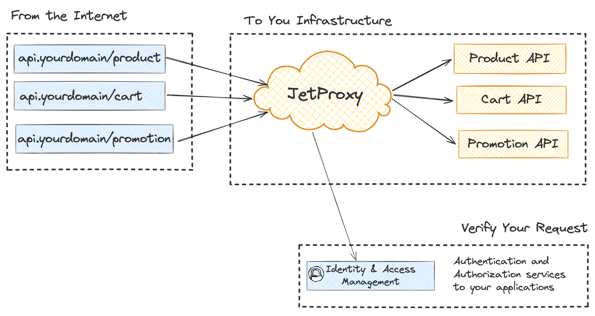

# JetProxy

**JetProxy** is a lightweight, high-performance HTTP proxy library built with Jetty. It is designed for developers seeking a flexible and efficient solution for routing, caching, and managing HTTP requests.

## Getting Started

In today’s fast-paced microservices architecture, an efficient and automated API gateway is crucial. Managing connections between microservices and external users can be challenging, especially in dynamic environments where services are frequently added, removed, or updated.

Traditional reverse proxies require manual configuration for each route, making them less practical for modern setups. JetProxy introduces a lightweight, high-performance HTTP proxy library designed to simplify routing and dynamically direct traffic to your microservices with minimal effort.

With its YAML-based configuration, JetProxy enables developers to define routing rules, apply caching, and configure middleware efficiently. Its flexibility makes it ideal for modern microservices setups where scalability and simplicity are paramount.

### Key Features

- **Dynamic Routing**  
  Advanced routing rules based on headers, query parameters, paths, and more, allowing precise traffic management without complex scripts.

- **Customizable Middleware**  
  Pre-built middleware for tasks like authentication, rate limiting, header manipulation, and caching to streamline HTTP request handling.

- **High Performance**  
  Built on Jetty, JetProxy is designed for low-latency, high-throughput environments, ensuring reliability even under heavy traffic.

- **Resilience**  
  JetProxy ensures reliability and fault tolerance with built-in mechanisms such as:
  - **Circuit Breaker**: Protects your system from cascading failures by halting traffic to unhealthy services and resuming only when stability is restored.
  - **Rate Limiter**: Controls traffic flow to prevent overloading backend services, handling spikes gracefully and maintaining optimal performance.
  - **HTTP Caching**: Reduces response times and backend load by caching frequently accessed resources using in-memory or Redis-based caching.

## Enhanced Security

JetProxy ensures your API is secure with robust authentication capabilities, including support for external authentication services. The `ForwardAuth` middleware allows seamless integration with external authentication mechanisms, enabling token validation and role-based access without tying security to a single system. This flexibility helps meet diverse security needs.

## Simplicity and Efficiency

JetProxy eliminates the need for constant manual updates by offering straightforward YAML configuration and real-time adjustments. Its intuitive design reduces operational complexity, enabling teams to focus on service development rather than maintaining intricate proxy configurations.

---

JetProxy is the modern solution for developers seeking an efficient and scalable API proxy. It integrates seamlessly into microservices architectures, offering dynamic routing, middleware customization, and robust security features to streamline API management. Whether you’re managing simple routes or complex traffic patterns, JetProxy delivers flexibility, performance, and ease of use.

