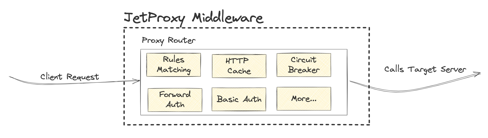

# Overview



In JetProxy, middleware is a powerful tool used to modify or adjust requests before they are forwarded to your services, or to modify responses before they are sent back to the clients.

JetProxy offers several types of middleware that can be used to customize the behavior of your requests. For example, some middleware can handle authentication, or even manage caching behavior. Middleware provides a way to add additional layers of control and customization to ensure that requests and responses meet your application's needs.

Multiple middleware that use the same protocol can be combined into a chain, allowing for flexible and powerful configurations to handle a wide variety of scenarios.
## Configuring Examples
```yaml
proxies:
  - path: /products
    service: productApi
    middleware:
      auth: 'basicAuth:roleA' # Add basic Auth with Role
      rule: "(Header('Content-Type', 'application/json') && HeaderPrefix('User-Agent', 'Mozilla')) || HeaderRegex('X-Custom-Header', '^[a-zA-Z0-9]{10}$')" # Rule Mathcing
      circuitBreaker:
        enabled: true
        failureThreshold: 50 # 50% failure rate threshold
        slowCallThreshold: 50 # 50% slow call rate threshold
        slowCallDuration: 2000 # 2 seconds threshold for slow calls
        openStateDuration: 10 # 10-second wait in open state
        waitDurationInOpenState: 10000  # 10-second wait in open state
        permittedNumberOfCallsInHalfOpenState: 3 # 3 calls in half-open state
        minimumNumberOfCalls: 5 # Minimum of 5 calls before evaluating
    ttl: 1000 # Enabled HTTP Cache

```

## Available HTTP Middlewares

| Middleware         | Description                                        | Link                                             |
|---------------------|----------------------------------------------------|-------------------------------------------------|
| **BasicAuth**       | Handles basic authentication.                      | [Documentation](/docs/middleware/basic-auth)    |
| **ForwardAuth**     | Forwards authentication to an external service.    | [Documentation](/docs/middleware/forward-auth)  |
| **JWT Auth**        | Validates and processes JSON Web Tokens (JWT).     | [Documentation](/docs/middleware/jwt-auth)      |
| **Rules**           | Defines routing and matching rules.                | [Documentation](/docs/middleware/rules)         |
| **Headers**         | Manages request and response headers.              | [Documentation](/docs/middleware/headers)       |
| **Cache**           | Configures caching for responses.                  | [Documentation](/docs/middleware/cache)         |
| **Circuit Breaker** | Implements circuit breaker logic for fault tolerance. | [Documentation](/docs/middleware/circuit-breaker) |
| **CORS Headers**    | Handles Cross-Origin Resource Sharing (CORS) headers. | [Documentation](/docs/middleware/cors-headers)  |
| **Rate Limiter**    | Limits the rate of incoming requests.              | [Documentation](/docs/middleware/rate-limiter)  |


