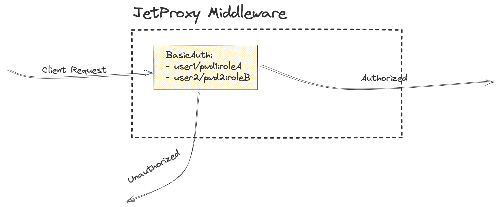

# BasicAuth



The BasicAuth middleware restricts access to services, allowing only authorized users/clients to proceed.

### Configuring Service Routers

```yaml
proxies:
  - path: /task
    service: tasksApi
    middleware:
      basicAuth: 'basicAuth:roleB'
    ttl: 10000
users:
  - username: userA
    password: passwordA
    role: roleA
  - username: userB
    password: passwordB
    role: roleB
```

In this configuration, the users section defines the credentials and roles for authorized users who can access services secured by the BasicAuth middleware. Here's a breakdown:

* `username`: Specifies the unique identifier for the user. For example, userA or userB.
* `password`: Represents the user's password in plaintext for simplicity (though in practice, passwords should ideally be hashed).
* `role`: Defines the role assigned to the user. Roles are used to control access to specific routes or services, as defined in the middleware configuration.

### Basic Authentication Mechanism

When a user attempts to access a protected route, they must provide credentials using the `Authorization` header in their request. The credentials are sent in the format:
```
Authorization: Basic <Base64 encoded username and password>
```

#### Sample CURL
```
curl --location 'http://localhost:8080/products' \
--header 'User-Agent: Mozilla' \
--header 'Content-Type: application/json' \
--header 'Authorization: Basic dXNlckI6dXNlckI='
```