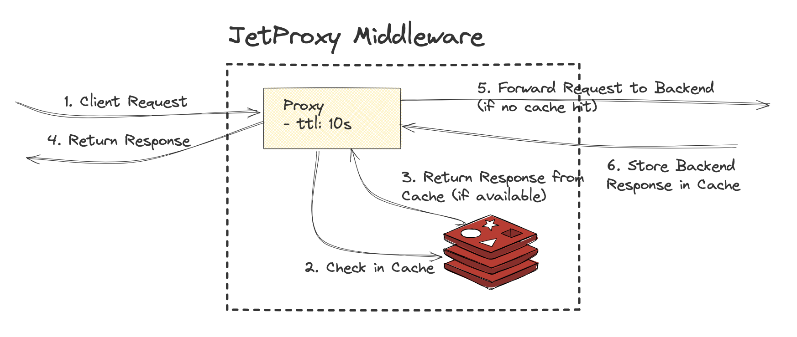

# Cache




The HTTP cache stores a response associated with a request and reuses it for subsequent requests. Cache types can be enabled based on requirements:

* In-memory Cache: Uses an LRU (Least Recently Used) strategy for efficient memory usage and fast access.
* Redis Cache: Provides distributed caching with a configurable TTL (Time-To-Live) for scalability and persistence.

## Setup Storage Cache

```yaml
storage:
  redis:
    enabled: true
    host: localhost
    port: 6379
    database: 1
    maxTotal: 128       # Maximum total connections in the Redis connection pool
    maxIdle: 64         # Maximum idle connections in the Redis connection pool
    minIdle: 16         # Minimum idle connections in the Redis connection pool
  inMemory:             # In-memory cache (stored in application memory)
    enabled: true
    maxMemory: 50       # Maximum memory allocation for the cache in MB
    size: 10000         # Maximum number of entries in the cache

```

If both `redis.enabled` and `inMemory.enabled` are set to `true`, Redis will be prioritized and used as the primary caching mechanism.


## Configuration Examples

```yaml
proxies:
  - path: /httpbin
    service: httpbinApi
    ttl: 1000
  - path: /products
    service: productApi
    ttl: -1
```

### Additional Notes:

**No Cache (ttl: -1)**

* Caching is disabled, meaning every request will be forwarded to the backend service without any response being stored or reused.

**Supported Methods and Protocol**
* Caching only applies to GET requests, as these are typically idempotent and safe for caching.
* The proxy supports caching only for requests over the HTTP protocol. Non-GET methods (e.g., POST, PUT) or requests over non-HTTP protocols will not use caching, regardless of the TTL setting.

