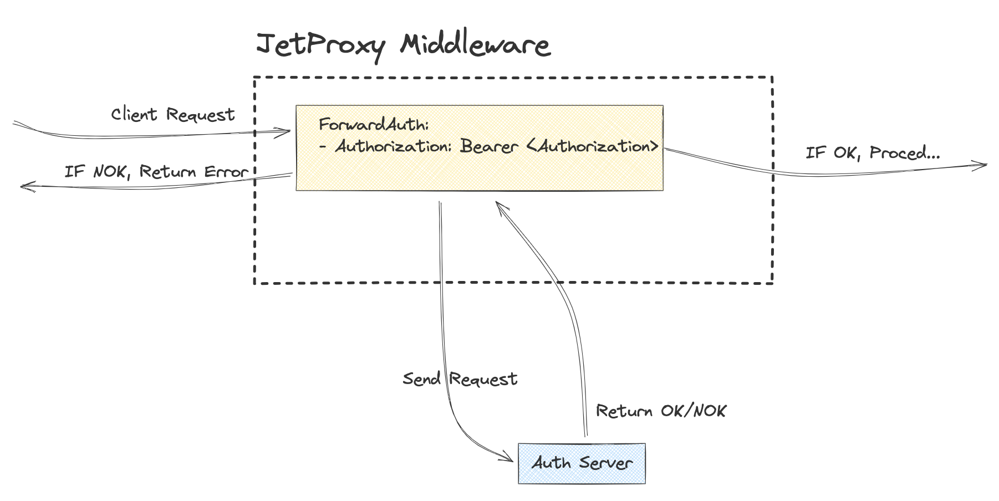

# ForwardAuth



The `ForwardAuth` is a flexible `Authenticator` implementation designed for external authentication delegation. It allows forwarding specific request headers to an external service and processing the response headers dynamically.

| Action  | Pattern Syntax                        | Description                                                                 | Use Case Example                                                                 |
|---------|---------------------------------------|-----------------------------------------------------------------------------|---------------------------------------------------------------------------------|
| Forward | `Forward(headerPattern)`             | Forwards headers matching the specified pattern to the external service.    | Forward `Authorization` or headers starting with `X-Custom-*` to the external authentication service. |
| Copy    | `Copy(sourcePattern, targetPrefix)`  | Copies headers matching `sourcePattern` to a new namespace with `targetPrefix`. | Copy `X-Trace-ID` to a new header prefixed with `X-New-` (e.g., `X-New-Trace-ID`). |
| Append  | `Append(headerPattern, value)`       | Appends a value to existing headers matching the specified pattern.         | Add `trace123` to `X-Request-ID`.                                              |
| Modify  | `Modify(headerPattern, oldValue, newValue)` | Modifies the value of headers matching the pattern by replacing `oldValue` with `newValue`. | Replace `Chrome` with `Firefox` in the `User-Agent` header.                   |

 ** By default forward "Authorization" header

## Configuration Examples

### Example 1: Basic Forward Authentication

```yaml
service:
  - name: authApi
    url: http://localhost:30001
    methods: ['POST']
forwardAuth:
  service: authService
  path: /validate
  authRequestHeaders: |
    Forward(Authorization); 
    Forward(X-Custom-*)
  authResponseHeaders: |
    Forward(X-Auth-*)
```
Explanation
* Forwards Authorization and all headers starting with `X-Custom-`.
* Extracts all headers starting with `X-Auth-` from the response.

### Example 2: Advanced Header Manipulation

```yaml
service:
  - name: authApi
    url: http://localhost:30001
    methods: ['POST']
forwardAuth:
  service: authApi
  path: /verify
  authRequestHeaders: |
    Forward(X-Custom-*); 
    Copy(X-Trace-ID, X-New-); 
    Append(X-Request-ID, trace123); 
    Modify(User-Agent, Chrome, Firefox)
  authResponseHeaders: |
    Forward(X-Auth-*); 
    Copy(Set-Cookie, Custom-Cookie)

```

Explanation

Request Header Actions:
* Forward: Include all headers starting with `X-Custom-*`.
* Copy: Copy `X-Trace-ID` into a new namespace prefixed with `X-New-`.
* Append: Append `trace123` to `X-Request-ID`.
* Modify: Replace Chrome with Firefox in the `User-Agent` header.

Response Header Actions:
* Forward: Include all headers starting with `X-Auth-*`.
* Copy: Copy the `Set-Cookie` header into a new header prefixed with `Custom-Cookie`.