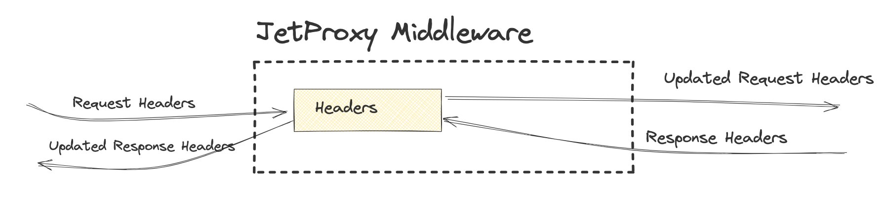

# Headers



The Headers middleware handles the management of request and response headers.

By default, a predefined set of forwarded headers is automatically included.


| Action   | Pattern Syntax                        | Description                                                                 | Best Practice Use Case Example                                                 |
|----------|---------------------------------------|-----------------------------------------------------------------------------|--------------------------------------------------------------------------------|
| Forward  | `Forward(headerPattern)`             | Forwards headers matching the specified pattern to the external service.    | Forward `Authorization` or headers starting with `X-Custom-*` to an external authentication or logging service to ensure accurate user tracking and logging. |
| Copy     | `Copy(sourcePattern, targetPrefix)`  | Copies headers matching `sourcePattern` to a new namespace with `targetPrefix`. | Copy `X-Trace-ID` to `X-New-Trace-ID` for tracking the same request through multiple systems without altering the original trace ID. |
| Append   | `Append(headerPattern, value)`       | Appends a value to existing headers matching the specified pattern.         | Append `environment=test` to headers like `X-Env` for marking non-production requests while preserving existing values. |
| Modify   | `Modify(headerPattern, oldValue, newValue)` | Modifies the value of headers matching the pattern by replacing `oldValue` with `newValue`. | Replace `Bearer` with `JWT` in the `Authorization` header when migrating to a new token system. |
| Add      | `Add(headerName, value)`             | Adds a header with the specified name and value.                            | Add `X-Powered-By` header with the value `Jetty-Server` to communicate server metadata for debugging and support. |
| Remove   | `Remove(headerPattern)`              | Removes headers matching the specified pattern.                             | Remove sensitive headers like `Authorization` or `Cookie` before forwarding a request to prevent leaking credentials to third-party services. |

## Configuration Examples


```yaml
proxies:
  - path: /user
    service: userApi
    middleware:
      header:
        requestHeaders: "Remove(x-header-*);Remove(Authorization);Append(X-Custom-Header,-jetty)"
        responseHeaders: "Add(X-Powered-By,jetty-server)"
```

A client sends the following request to the /user endpoint:
```
GET /user HTTP/1.1
Host: example.com
Authorization: Bearer abc123
X-Header-Test: TestValue
X-Custom-Header: CustomValue
```
**Request Headers:**
* Authorization header is removed.
* Any header starting with x-header- (e.g., X-Header-Test) is removed.
* The value -jetty is appended to X-Custom-Header, resulting in X-Custom-Header: CustomValue-jetty.

```
GET /user HTTP/1.1
Host: example.com
X-Custom-Header: CustomValue-jetty
```

**Response Headers:**

The backend userApi returns the following response:

```
HTTP/1.1 200 OK
Content-Type: application/json
```

The final response sent back to the client includes the added header:
```
HTTP/1.1 200 OK
Content-Type: application/json
X-Powered-By: jetty-server
```

This setup ensures headers are appropriately sanitized, modified, and enhanced based on the middleware rules.