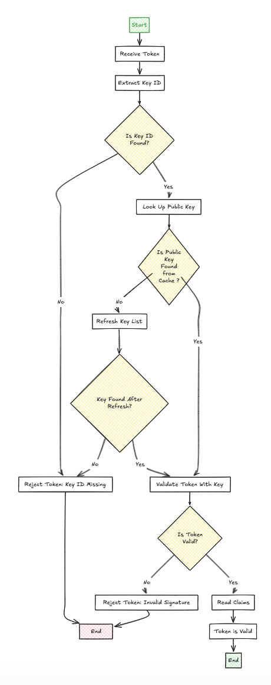

# JWT Auth

The `JWTAuth` middleware is a designed to validate and process JSON Web Tokens (JWTs). It ensures that only authorized requests are forwarded to your backend services by validating the authenticity and integrity of the tokens.
[Learn more about JSON Web Tokens (JWT)](https://jwt.io/)

## Features

- **Claim Verification**:
  - Supports dynamic claim validation (e.g., `iss`, `aud`).
- **JWKS Support**:
  - Dynamically fetches public keys for RSA-based tokens from a JWKS endpoint.
- **Custom Header Forwarding**:
  - Extracts claims from JWTs and forwards them as headers to backend services.

## Claim Forwarding

The `JWTAuth` middleware forwards validated claims to backend services through a single header: `jetproxy-jwt-claims`.
- **Header Name**: `jetproxy-jwt-claims`
- **Header Value**: JSON representation of all claims from the validated JWT.

For the JWT payload:
```json
{
  "sub": "123456",
  "name": "John Doe",
  "iss": "auth.myapp.com",
  "iat": 1735439621,
  "exp": 1735443221
}
```

## Configuration Examples
### Basic JWT Authentication

```yaml
proxies:
  - path: /user
    service: userApi
    middleware:
      jwtAuth:
        enabled: true

services:
  - name: userApi
    url: http://localhost:30001
    methods: ['GET']

jwtAuthSource:
  headerName: "Authorization"
  tokenPrefix: "Bearer "
  secretKey: "U2VjdXJlU3Ryb25nS2V5Rm9yVXNpbmdXaXRoSFMyNTY="
  claimValidations:  #Optional
    iss: "auth.myapp.com"
```

Explanation:

* Header Name: Reads the JWT from the `Authorization` header.
* Token Prefix: Strips the `Bearer ` prefix from the token.
* Use `HS256` algorithm for token verification.
* Claim Validations: Ensures the iss (issuer) claim matches `auth.myapp.com`.

> Claim forwarding is enabled by default, but may cause `Error: Request header too large`. Resolve by increasing the destination server's header size limit or adding `header.requestHeaders: "Remove(jetproxy-jwt-claims)"` to disable claim forwarding.

### Advanced Configuration with JWKS

```yaml
proxies:
  - path: /user
    service: userApi
    middleware:
      jwtAuth:
        enabled: true

services:
  - name: userApi
    url: http://localhost:30001
    methods: ['GET']

jwtAuth:
  headerName: "Authorization"
  tokenPrefix: "Bearer "
  jwksUri: "https://auth.example.com/.well-known/jwks.json"
  jwksType: "x509"  # Specify type: x509 or jwk
  jwksTtl: 1000 # Cache response from jwksUri
  claimValidations:
    aud: "my-application"

```


Explanation:

* JWKS URI: Dynamically fetches public keys for RS256 tokens from the JWKS endpoint.

>  The `kid` (Key ID) is **mandatory** for public key signing (e.g., RS256). It identifies the correct public key from the `jwksUri` for validation. Missing or invalid `kid` results in a `401 Unauthorized` error. Ensure the `kid` is present in the JWT header and matches a key in the `jwksUri` to avoid rejection.

## Real-World Use Cases and Configurations

In many scenarios, integrating JWT authentication does not require using a provider's SDK. Instead, you can handle token validation directly using standard libraries or custom logic. By leveraging public key endpoints (JWKS) or secret keys, you can verify JWTs without relying on specific SDKs, making the integration lightweight and flexible.


### Case: Firebase Authentication

Firebase uses JWTs to authenticate users. The tokens are signed with RS256 and validated using Google's JWKS endpoint.

```yaml
jwtAuthSource:
 headerName: "Authorization"
 tokenPrefix: "Bearer "
 jwksUri: "https://www.googleapis.com/robot/v1/metadata/x509/securetoken@system.gserviceaccount.com"
 jwksType: "x509"  # Specify type: x509 or jwk
 jwksTtl: -1
 claimValidations:
   iss: "https://securetoken.google.com/{YOUR_FIREBASE_ID}"
   aud: "{YOUR_FIREBASE_ID}"
```

### Case: Supabase

Supabase provides JWTs signed with a symmetric key (HS256). You’ll need to configure the secretKey to validate these tokens.

```yaml
jwtAuthSource:
 headerName: "Authorization"
 tokenPrefix: "Bearer "
 secretKey: "{YOUR_SECRET_KEY}"
 claimValidations:
   iss: "https://{YOUR_PROJECT_ID}.supabase.co/auth/v1"
```
### Case: Auth0

Auth0 uses JWKS to dynamically validate tokens signed with RS256. Tokens can be fetched from the `.well-known/jwks.json` endpoint.

```yaml
jwtAuthSource:
  headerName: "Authorization"
  tokenPrefix: "Bearer "
  jwksUri: "https://{YOUR_AUTH0_DOMAIN}.com/.well-known/jwks.json"
  jwksTtl: 1000
  jwksType: "jwk"
```
