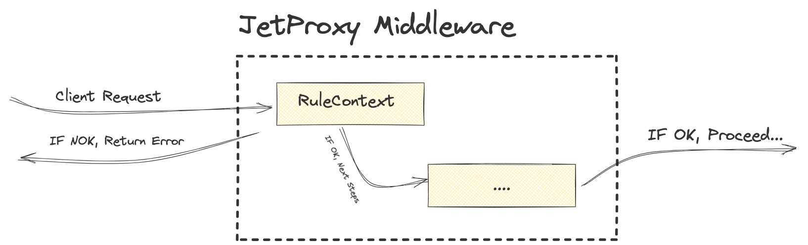

# Rules


The RuleContext middleware evaluates incoming requests against defined rules. If a request fails validation, an error is returned; otherwise, the request proceeds to the next step.

## Rule Types and Definitions

| **Rule Type**      | **Description**                                                                                      | **Example**                                                                                 |
|---------------------|------------------------------------------------------------------------------------------------------|---------------------------------------------------------------------------------------------|
| **HEADER**          | Matches the exact value of a specific HTTP header.                                                  | `Header('Content-Type', 'application/json')` matches `Content-Type: application/json`.      |
| **HEADER_PREFIX**   | Matches when the header value starts with the given prefix.                                         | `HeaderPrefix('User-Agent', 'Mozilla')` matches `User-Agent: Mozilla/5.0`.                 |
| **HEADER_REGEX**    | Matches the header value using a regular expression.                                                | `HeaderRegex('X-Custom-Header', '^[a-zA-Z0-9]{10}$')` matches a 10-character alphanumeric string. |
| **QUERY**           | Matches an exact query parameter key-value pair.                                                    | `Query('status', 'active')` matches `?status=active`.                                       |
| **QUERY_PREFIX**    | Matches when the query parameter value starts with the specified prefix.                            | `QueryPrefix('filter', 'user_')` matches `?filter=user_123`.                                |
| **QUERY_REGEX**     | Matches the query parameter value using a regex.                                                    | `QueryRegex('id', '\\d+')` matches `?id=123`.                                               |
| **PATH**            | Matches the exact request path.                                                                     | `Path('/tasks')` matches `/tasks`.                                                         |
| **PATH_PREFIX**     | Matches paths with the specified prefix.                                                            | `PathPrefix('/api')` matches `/api/tasks`.                                                 |
| **PATH_REGEX**      | Matches the path using a regex.                                                                     | `PathRegex('/user/[a-z]+')` matches `/user/john`.                                           |
| **HOST**            | Matches the exact hostname.                                                                         | `Host('example.com')` matches `example.com`.                                               |
| **HOST_PREFIX**     | Matches when the hostname starts with the specified prefix.                                         | `HostPrefix('api.')` matches `api.example.com`.                                            |
| **HOST_REGEX**      | Matches the hostname using a regex.                                                                 | `HostRegex('.*\\.example\\.com')` matches `sub.example.com`.                                |


### Configuring Rules

```yaml
proxies:
  - path: /task
    service: tasksApi
    middleware:
      basicAuth: 'basicAuth:roleB'
      rule: "(Header('Content-Type', 'application/json') && HeaderPrefix('User-Agent', 'Mozilla')) || HeaderRegex('X-Custom-Header', '^[a-zA-Z0-9]{10}$')"
    ttl: 10000
service:
  - name: tasksApi
    url: http://localhost:5173/template/1on1-meeting-agenda/tasks.json
    methods: ['GET', 'POST', 'PUT']
```

The rule in the configuration defines the conditions that must be met for a request to proceed:

* It checks that the Content-Type header equals application/json AND the User-Agent header starts with Mozilla.
* OR it validates that the X-Custom-Header matches the regex pattern ^[a-zA-Z0-9]{10}$ (exactly 10 alphanumeric characters).