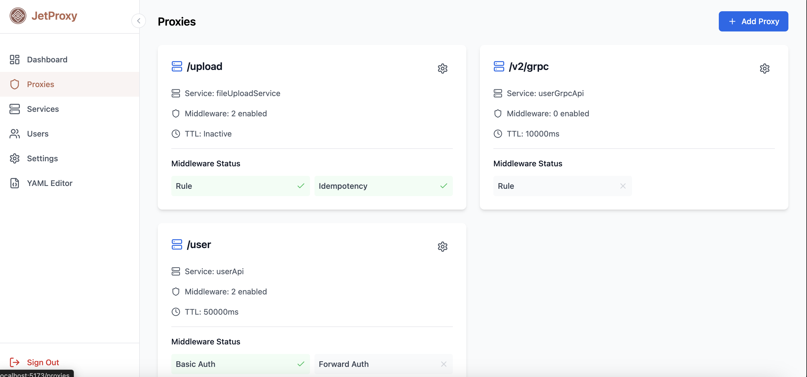

# Dashboard

**The JetProxy Dashboard** is the central place where you can monitor all currently active routes being handled by JetProxy. It provides a real-time view of route configurations, applied middleware, and backend service mappings—making it easy to understand.



## Configuring 

To enable access to the JetProxy dashboard, you need to:
* Enable the **Dashboard** by setting the dashboard value to **true**.
* Create an **Administrator** User under the users section.

```
dashboard: ${JET_DASHBOARD:true}     # Enable the dashboard
users:
  - username: admin                  # Admin username
    password: admin                  # Admin password (use strong password in production)
    role: administrator              # Role required to access protected routes like dashboard
```


## Run Dashbaord

You can manually serve the JetProxy dashboard by running the following single command:

```bash
git clone https://github.com/andywiranata/jetproxy.git && cd jetproxy/frontend && npm install && npm run build && npx http-server dist/
```